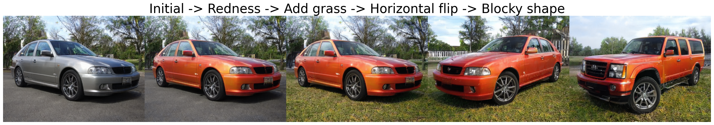

# GANSpace: Discovering Interpretable GAN Controls




This repository is the reproduction of [GANSpace: Discovering Interpretable GAN Controls](https://arxiv.org/abs/2004.02546) in TensorFlow 1.x as a part of the ML Reproducibility Challenge 2021 (Spring Edition). The original implementation of the paper uses PyTorch.
The accompanying reproducibility report and a summary of the results can be found in the [wiki](https://dagshub.com/midsterx/Re-GANSpace/wiki/Reproduction+of+GANSpace).

## Requirements

The code requires a Windows/Linux machine with one NVIDIA GPU, compatible NVIDIA drivers, CUDA 10.0 toolkit and cuDNN 7.5. For more information on installation instructions, please refer to the official NVIDIA installation guides:

1. **CUDA**: [Windows](https://docs.nvidia.com/cuda/archive/10.0/cuda-installation-guide-microsoft-windows/index.html), [Linux](https://docs.nvidia.com/cuda/archive/10.0/cuda-installation-guide-linux/index.html)
2. [**cuDNN**](https://docs.nvidia.com/deeplearning/cudnn/archives/cudnn_750/cudnn-install/index.html)

We use the official NVlabs [implementation](https://github.com/NVlabs/stylegan2) of StyleGAN/StyleGAN2 models which compile custom CUDA kernels on the fly. Please ensure that [NVCC](https://docs.nvidia.com/cuda/cuda-compiler-driver-nvcc/index.html) is installed and is in the system path.

All the code in this repository was successfully tested on two machines running Windows 10 and Ubuntu 18.04 LTS.

## Setup

1. *(Optional but recommended)* Create a virtual environment with conda: `conda create -n re-ganspace python=3.7`
2. *(Optional but recommended)* Activate the virtual environment: `conda activate re-ganspace`
3. Clone the repository: `git clone https://github.com/midsterx/ReGANSpace.git`
4. Install the required packages using pip: `pip install -r requirements.txt`
5. *(Optional but recommended)* The code automatically downloads the required StyleGAN/StyleGAN2 models and caches them locally. However, you can download them on your own using DVC: `dvc pull -r origin`

## Usage

### Reproducibility
[](https://colab.research.google.com/drive/1H5EApX3urHmfhhMLGFjzbJfXD73Qjtw3)

We successfully reproduce and verify all the StyleGAN/StyleGAN2 experiments from the original paper. The folder `figures` contain 5 python scripts that correspond to the StyleGAN/StyleGAN2 figures in the original [paper](https://arxiv.org/abs/2004.02546).

To generate the figures, run the following python scripts:

* **Figure 1** (`figure_1.py`): Demonstration of applying a sequence of hand tuned edits discovered using GANSpace on StyleGAN2 trained on the FFHQ and Cars datasets.
* **Figure 3** (`figure_3.py`): Illustration of the effect of variations along the principal components in the intermediate latent space of StyleGAN2 FFHQ.
* **Figure 4** (`figure_4.py`): Illustration of the significance of the principal components as compared to random directions in the intermediate latent space of StyleGAN2 Cats.
* **Figure 5** (`figure_5.py`): Illustration of the efficacy of GANSpace as compared to other supervised learning techniques in identifying edit directions.
* **Figure 7** (`figure_7.py`): Selection of interpretable edits discovered by selective application of latent edits across the layers of several pretrained GAN models.

The generated figures can be found in the `results` folder.

Alternatively, you can run the experiments on Google Colab by opening the python notebook linked in this section. Please ensure that you are using the GPU runtime.

### Additional Experiments and Playground
[](https://colab.research.google.com/drive/1rT782zZ1hKVvafreqIY5h2XPUXk5JjGK)

In addition to reproducing the authors' results, we ran our own experiments and identified interesting results. We briefly summarize them here:

* **New edits**: We identify new edits on the Stylegan2 Beetles dataset. The edit adds a pattern on the shell of the beetle. The generated pattern varies depending on the seed used.
* **Truncation Psi on StyleGAN**: The original authors use the "truncation trick" on images generated using StyleGAN2 to improve their quality. However, this is not enabled for StyleGAN images. During our experimentation, we found that enabling truncation while applying edits on StyleGAN images improved their quality as well.

The results from our experiments can be found in the `results/custom` folder.

We also provide a playground with an interactive UI where you can explore various edits using GANSpace on pretrained StyleGAN/StyleGAN2 models.

To run our custom experiments and use the playground, open the python notebook linked in this section on Google Colab. Please ensure that you are using the GPU runtime.

### Note

1. If you encounter `OSError: Google Drive quota exceeded` errors while running the experiments, please download the pretrained models using DVC as described in the [Setup](#setup) section.
2. BigGAN512-deep results were not reproduced from the original paper.

## Reference

```bibtex
@inproceedings{härkönen2020ganspace,
  title     = {GANSpace: Discovering Interpretable GAN Controls},
  author    = {Erik Härkönen and Aaron Hertzmann and Jaakko Lehtinen and Sylvain Paris},
  booktitle = {Proc. NeurIPS},
  year      = {2020}
}
```
